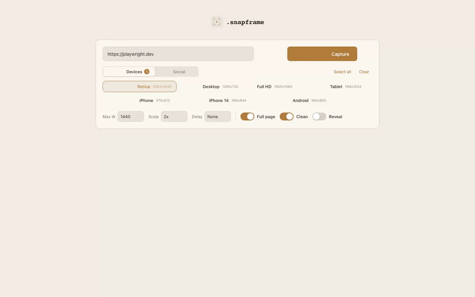

# .snapframe

[](https://github.com/soreavis/snapframe/actions/workflows/ci.yml)


**Capture any webpage in every viewport with one click.**



---

## Why .snapframe?

Stop resizing your browser manually. Paste a URL, pick your viewports, and get pixel-perfect screenshots in seconds.

## Features

- **Multi-viewport capture** — desktop, tablet, mobile in one go
- **Social presets** — YouTube, LinkedIn, X, Facebook, Instagram ready
- **PNG, JPEG, WebP** — download in any format, convert on the fly
- **PDF export** — full-page pageless PDF with a single click
- **Batch mode** — capture multiple viewports at once
- **Cookie cleanup** — auto-dismiss consent banners and overlays
- **Animation reveal** — force-show scroll-triggered hidden elements
- **Live preview** — tabbed results with sticky toolbar
- **Runs locally** — your URLs never leave your machine

## Quick Start

```bash
# 1. Clone
git clone https://github.com/soreavis/snapframe.git
cd snapframe

# 2. Install
npm install && npx playwright install chromium

# 3. Run
npm start
```

Open `http://localhost:3005` and start capturing.

## CLI Usage

`.snapframe` also ships as a headless CLI — perfect for scripts, CI, and agentic tools (Claude Code, etc.) that need a screenshot on demand without opening a browser.

```bash
# From a cloned repo
npm link                      # installs `snapframe` globally

# Single screenshot
snapframe https://example.com -o shot.png

# Use a social preset
snapframe https://example.com -p yt-thumb -o thumb.jpg -f jpeg

# Multi-viewport batch
snapframe https://example.com --batch desktop,mobile,yt-thumb --output-dir ./shots

# Full-page PDF
snapframe https://example.com --pdf -o page.pdf

# List built-in presets
snapframe presets

# Or run the web UI from the CLI
snapframe serve
```

Pipe binary output when no `-o` is given:

```bash
snapframe https://example.com --full-page --clean > shot.png
```

Exit codes: `0` success, `1` bad arguments, `2` URL rejected (invalid or blocked network), `3` capture failed.

Run `snapframe --help` for the full flag list.

## Social Presets

| Preset | Viewport | Use case |
|--------|----------|----------|
| YT Banner | 2560 x 1440 | YouTube channel art |
| YT Thumb | 1280 x 720 | YouTube thumbnail |
| LinkedIn Post | 1200 x 627 | LinkedIn feed image |
| LinkedIn Cover | 1584 x 396 | LinkedIn profile banner |
| X Post | 1600 x 900 | Twitter/X card image |
| X Header | 1500 x 500 | Twitter/X profile banner |
| FB Cover | 820 x 312 | Facebook cover photo |
| FB Post | 1200 x 630 | Facebook feed image |
| IG Post | 1080 x 1080 | Instagram square post |
| IG Story | 1080 x 1920 | Instagram story |

## Tech Stack

| Tool | Role |
|------|------|
| Playwright | Browser automation |
| Sharp | Image conversion (WebP, JPEG) |
| Express | Local web server |
| Vanilla JS | Frontend — no frameworks |

## Contributing

We'd love your help! Check out [CONTRIBUTING.md](CONTRIBUTING.md) to get started.

## License

[MIT](LICENSE) — Built by [Julian Soreavis](https://github.com/soreavis) with [Claude Code](https://claude.ai/claude-code)
